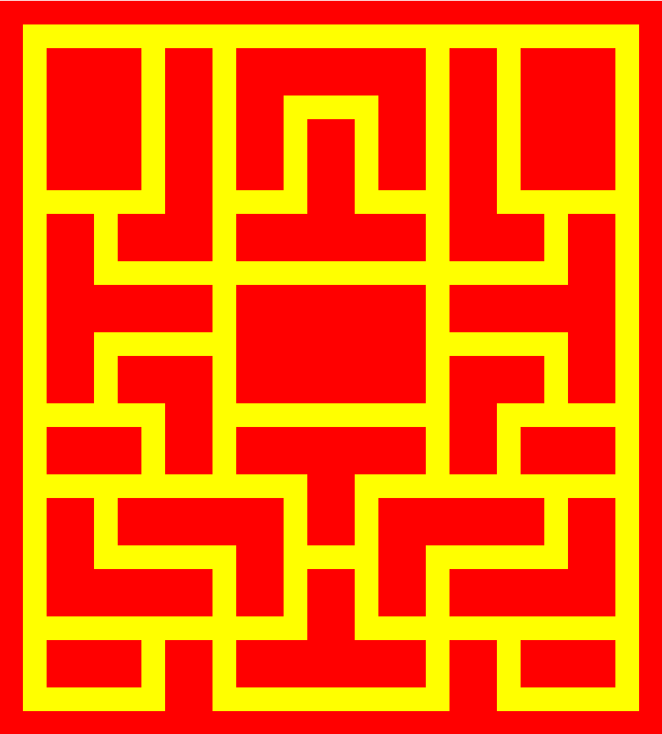
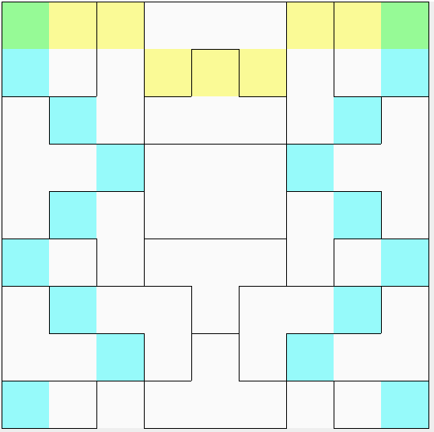

#Pacman

https://user-images.githubusercontent.com/54251767/134431705-ccb239c8-6b4a-462e-b0e5-16d4758985cb.mp4

<h2>The game</h2>
Features:
<ul>
  <li>Tunnels</li>
  <li>Ghosts make turns that seek out player</li>
  <li>Ghosts run from player when in vulnerable state</li>
  <li>Speed increases as game progresses</li>
  <li>3-lives system/li>
  <li>Unlimited leves</li>
  <li>New mazes every game</li>
  <li>Scoring System</li>
</ul>
<h2>Maze generation</h2>

The algorithm for generating the mazes was inspired by that described on <a href="https://shaunlebron.github.io/pacman-mazegen/">Shaun Lebron's Github</a>, which additionally defined constraints of traditional pac man mazes

<ul>
  <li>Map is 28x31 tiles</li>
  <li>Paths are only 1 tile thick</li>
  <li>No sharp turns - intersections are separated by atleast 2 tiles</li>
  <li>1-2 tunnels</li>
  <li>No dead-ends</li>
  <li>Only I, L, T, or + wall shapes are allowed, including the occasional rectangular wall</li>
  <li>Any non-rectangular wall pieces must only be 2 tiles thick</li>
</ul>

<h3>Original Pacman maze</h3>

<h3>The algorithm</h3>
The algorithm designed for this project relies on a tetris style building technique. A shape would be selected at random from a list of allowable states, and fit into a random position. Certain requirements for the board such as the pen for the ghosts to spawn in were taken into account for that step as well. This was repeated until the no more pieces could fit onto the board, at which point it was mirrored horizontally. This produced the structure pictured on the right. That picture also displays the marked small horizontal and vertical manipulations that occured to get the board to fit the 28x31 dimensions. The image on the left depicts the maze drawn from the original structure. Tunnels were easily added after the construction of the maze after considering which rows they could occur on.

  
   

<h3>Sample mazes</h3>

  
   
  

